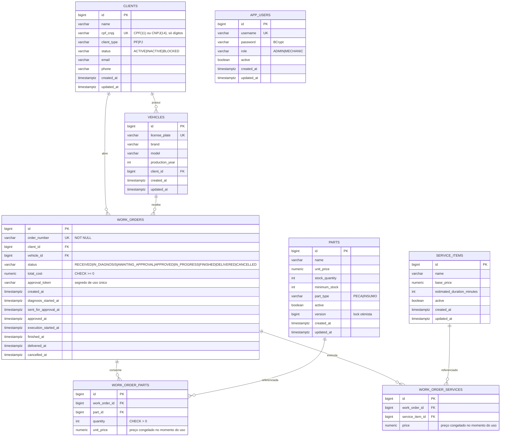

# Modelo de Dados — Fase 3

> Diagrama de Entidade-Relacionamento (ER) do banco de dados PostgreSQL da aplicação Oficina Mecânica.
> Estrutura finalizada em E1 com consistência temporal (TIMESTAMPTZ), status de cliente e índices de performance.

## Diagrama ER



## Justificativa dos Relacionamentos

- **CLIENTS 1—N VEHICLES**: um veículo pertence a exatamente um cliente. Transferência de propriedade é atualização de `client_id`, não novo veículo — a placa é a identidade natural.

- **WORK_ORDERS referencia cliente e veículo separadamente**: embora o veículo já aponte para um cliente, a OS registra quem *contratou* o serviço, que pode diferir do proprietário atual do veículo depois de uma venda. Sem essa coluna, o histórico da OS mudaria de dono retroativamente ao transferir o carro.

- **WORK_ORDER_PARTS e WORK_ORDER_SERVICES guardam preço próprio**: o preço do catálogo muda, o valor cobrado numa OS fechada não pode mudar junto. É *snapshot* deliberado, não desnormalização acidental.

- **APP_USERS não se relaciona com CLIENTS**: são identidades diferentes (funcionário × cliente). O cliente autentica por CPF via Lambda e nunca recebe linha em `app_users`.

## Mudanças na Fase 3 (E1)

### TIMESTAMP → TIMESTAMPTZ
Todas as colunas de data/hora (`clients`, `vehicles`, `parts`, `service_items`, `work_orders`, `app_users`) convertidas de `TIMESTAMP` para `TIMESTAMPTZ`.

**Motivo:** A oficina expandiu para múltiplas unidades. `TIMESTAMP` sem fuso grava o horário local do servidor e torna impossível comparar duas unidades ou calcular corretamente o "tempo médio por status" do dashboard (R7) quando o pod roda em UTC e o usuário lê em `America/Sao_Paulo`.

### Novo campo: clients.status
- `VARCHAR(10) NOT NULL DEFAULT 'ACTIVE'`
- `CHECK (status IN ('ACTIVE', 'INACTIVE', 'BLOCKED'))`

**Motivo:** R3 exige que o Lambda consulte "a existência **e o status** do cliente":
- `ACTIVE`: cliente ativo, pode autenticar e contratar serviços.
- `INACTIVE`: cadastro desativado voluntariamente ou por inatividade.
- `BLOCKED`: impedido de autenticar (inadimplência, fraude, etc.).

### Índice parcial para autenticação
```sql
CREATE INDEX idx_clients_cpf_active
    ON clients (cpf_cnpj) WHERE status = 'ACTIVE'
```

**Motivo:** A consulta do Lambda é sempre `cpf_cnpj = ? AND status = 'ACTIVE'`. Índice parcial é menor e mais quente em cache que o índice completo.

### Índices de performance
- `idx_work_orders_created_at`: para dashboard R7 "volume diário"
- `idx_work_orders_status_created_at`: para dashboard R7 "tempo médio por status"
- `idx_work_orders_client_created_at`: para `GET /api/work-orders/me`
- `idx_work_order_parts_part_id`, `idx_work_order_services_service_item_id`: evita *sequential scan* em validação de FK

**Motivo:** Sem índices, as duas consultas de dashboard e o endpoint `/me` rodam em *sequential scan* na tabela que mais cresce.

### Constraints de domínio
Garantem integridade para qualquer cliente do banco (não apenas via aplicação):
- `work_orders.total_cost >= 0`
- `work_orders.status IN (...)` — os 8 estados definidos
- `work_order_parts.quantity > 0`, `work_order_parts.unit_price >= 0`
- `work_order_services.price >= 0`
- `parts.stock_quantity >= 0`, `parts.minimum_stock >= 0`, `parts.unit_price >= 0`
- `service_items.base_price >= 0`, `service_items.estimated_duration_minutes > 0`
- `vehicles.production_year BETWEEN 1900 AND 2100`
- `clients.email = lower(email)`: normaliza email para minúsculo

### Pool de conexões
Redimensionado de 20 para 8 conexões por pod (4 réplicas máximo):
- `max-size=8`, `min-size=2`, `acquisition-timeout=5s`

**Motivo:** `db.t4g.micro` tem ~112 conexões máximas no RDS. Com 4 × 20 = 80 conexões + Lambda + sessões administrativas, encosta no teto. 4 × 8 = 32, com folga de sobra. Para API com I/O curto, 8 conexões por pod sustentam bem mais throughput.

### Papel de leitura para Lambda (V6)
```sql
CREATE ROLE oficina_auth_ro LOGIN PASSWORD '${lambda_ro_password}';
GRANT SELECT (id, name, cpf_cnpj, client_type, status) ON clients TO oficina_auth_ro;
```

**Motivo:** O Lambda consulta clientes diretamente. Usar o usuário mestre daria à função exposta na internet poder de `DROP TABLE`. Papel dedicado com SELECT restrito a colunas necessárias. A senha entra por placeholder do Flyway, alimentado pelo Secret do Kubernetes — nunca literal na migration.
